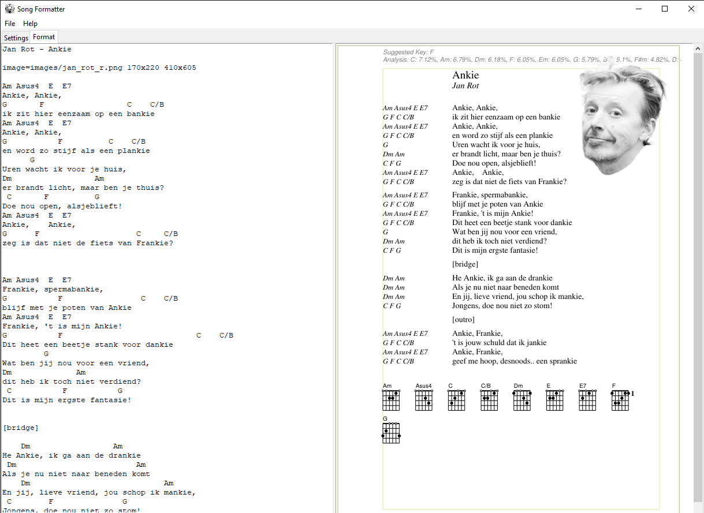

# Song Formatter Documentation

## Overview:

Song Formatter is a tool that converts text files with lyrics and chords into printable PDFs.

It aims to display as much information as possible on a single page without sacrificing readability. It can print guitar and piano finger positions.

The tool's default settings provide a customizable layout. You can add images. Capo, transpose and custom tuning are supported.


## Features:
* Converts lyrics and chords into PDFs.
* Supports guitar and piano finger positions.
* Provides customizable layout and settings.
* Allows addition and placement of images.
* Supports CAPO and TRANSPOSE features.
* Facilitates insertion of page breaks, blank lines, and horizontal lines.
* Allows setting of default values for font and size.
* Supports in-line overriding of default settings.
* Supports multiple standard fonts and their variations.
* Filters double blank lines automatically.

## Screenshot:


## Typical Usage
Copy'n'paste your chosen song from your favorite song+chords site or archive, or just write your own song or transcription. The de-facto format is: Title, blanc line, chord line, text line, chord line, text line etc. (and has been like that since pre-internet era.). Make adjustments. See preview of the converted text in real-time. Export as PDF when satisfied. Print the pdf.

## Installing
Windows: You can use the self-signed executable. Windows Defender may complain about unverified publisher.
You can check the certificate, beta's are signed with a certificate that has serial number 5bf7ba0b9edddc6fab6b13cbd84afeaa6db711a8 and a thumbprint hash of fcc404ebfbc248700182afe06488fc4307a5a477
You could upload the file to virustotal to confirm it is free of virusses. Alternatively, you could install python and run from source.

To run from source (any platform):
* Extract the source files to a directory of choice
* Install a recent version of Python (3.10+)
* Open a command line and use pip to install some additional libraries:
```pip install markdown tkhtmlview reportlab PIL```
* start the application:
```python SongFormatter.py```
* The application will keep a settings file in the same directory.


## File Format:

The standard file format includes the artist's name, the song title, BPM, and key at the top, followed by lines of chords and lyrics. Double blank lines will be filtered out.
```Artist Name - Song Title
BPM: xxx
Key: x
  
[chords line]
[song lyrics]
[chords line]
[song lyrics]```

## Formatting Options:

Song Formatter uses several special commands: 
```'/P' forces a page break. 
'/B' adds an extra blank line. 
'/U' moves the cursor up one line. 
'/L' inserts a horizontal line. 
'/FL' inserts a full-width horizontal line.```
This command should be the only text on a line. If any other text is on the line, it will be rendered normal.

## Settings:

The settings section lets you set default values for things like font and size. 
The units are in 'Point', where a point is 1/72 inch. US Letter size is 8.5 x 11 inches (612 x 792 points), and A4 size is 8.27 x 11.69 inches (595 x 842 points).
You can override these settings in-line with an assignment. You can assign (almost) any setting variable. Examples:
```font=Times-Roman
fontsize=12 
marginleft=150
chordswidth=175
pagetop=800
transpose=3 
capo=IV```

## Adding Images:

You can add images with the image setting. The tool supports multiple images and will print them in the order you define. If you don't want images to overlap text, define them in the right order. Images should be in a format supported by reportlab. The 'image' command has two parameters. The first one defines the image dimensions, and the second one sets its position on the sheet. If you don't specify a position, the image will be displayed at the current position.
The 'image' command syntax is:
```image=path/to/imagefile.png 100x100 500,700```

The first parameter after 'image=' defines the image dimensions, and the second one sets its position on the sheet. 

## Tuning
You can specify any tuning with a minimum of 4 strings. The standard tuning is 'EADGBE'. Example:
```tuning=CFBbEbGC```

## Capo
You can specify to use a capotasto. Guitar chords will be rendered taking the Capo in account on the specified fret.
```capo=II```
If you want to indicate the use of a capo at the top of the page, include it in the header section.

## transpose
You can transpose all chords to another key, by defining the amount of semitones to transpose with.
```transpose=-2```

## Overriding finger positions
Frets are automatically calculated based on the chord played. Sometimes this is not optimal. You can specify a chord override as follow:
```Dm=x00231```
You should use the same notation for the chord as was used in the song. So, if you wrote CM7 you should use that instead of 'Cmaj7'. Only valid chords can be overriden*. You can only use numbers and an 'x'. The amount of characters should match the tuning.

## Supported fonts
Please note that font names are case-sensitive, and that you have to specify the full font name e.g. 'Times-Roman' and not 'Times' or 'Italic'.
```Courier
Courier-Bold
Courier-BoldOblique
Courier-Oblique
Helvetica
Helvetica-Bold
Helvetica-BoldOblique
Helvetica-Oblique
Times-Roman
Times-Bold
Times-BoldItalic
Times-Italic
Symbol
ZapfDingbats```


## Issues
- 11 chords are not implemented correctly
- Images are not cached for drawing. When large images are used, rendering could be slower. If so, add the image after you are done editing the text
- The layout is bit Spartan, UI options for file handling could be better
- A minor graphical imperfection/glitch. If you find it i buy you a coffee. Nothing should be perfect.
- It is certainly possible that some data or invalid setting values stop the rendering process, resulting in a grey window where the pdf should be. If so, correct the error and it should render.
