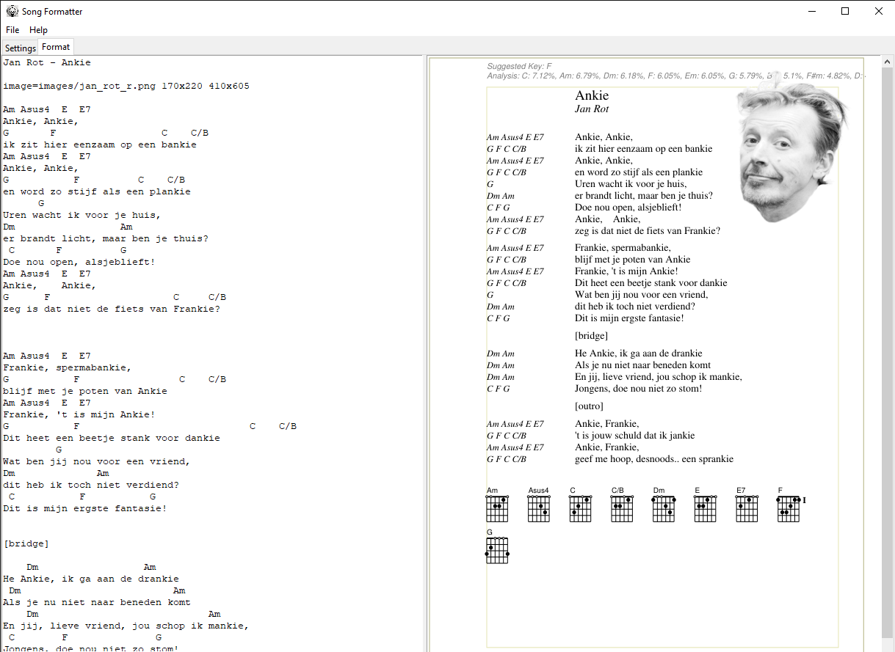

# Song Formatter

## Overview

Song Formatter converts plain text files with lyrics and chords into printable PDFs.

It is designed for quick editing and previewing of chord sheets while keeping as much content as possible on a single page without making the layout unreadable. It can render guitar and piano chord information, supports images, capo and transpose settings, and keeps a live PDF preview while you edit.

The application is currently source-first and workspace-oriented:

- you can work on multiple song documents at once
- open documents are restored between sessions
- editing is autosaved to a local workspace
- exporting text and PDF is separate from in-app editing

The current project workflow assumes running from source. There is no maintained packaged install or binary release flow at the moment.

## Features

- Live PDF preview while editing
- Multi-document tabs
- Session restore for open documents
- Save text, save PDF, or export both together
- `Paste As New` to turn clipboard text into a fresh document tab
- Configurable global defaults through the Settings tab
- In-document overrides for layout and rendering
- Optional background images
- Guitar and piano chord rendering
- Capo, transpose, and custom tuning support
- Experimental key analysis with multiple detection strategies

## Screenshot



## Running From Source

Requirements:

- Python 3.10+
- Tk support in your Python installation

At the moment, the repository does not include Python packaging metadata such as `pyproject.toml`, so the supported path is to run from source rather than install it as a package.

Recommended local workflow:

```bash
./run.sh
```

`run.sh` will:

- create `.venv/` if needed
- install or update the packages from `requirements.txt`
- launch the app

On Windows, use:

```bat
winrun.bat
```

`winrun.bat` performs the same setup steps using the local Windows Python launcher.

If you prefer manual setup:

```bash
python3 -m venv .venv
source .venv/bin/activate
python -m pip install -r requirements.txt
python SongFormatter.py
```

## App Workflow

The application now has a `Documents` area and a `Settings` area.

### Documents

Each open song lives in its own tab.

Available actions:

- `New`: create a new song tab
- `Load`: load a text file into a tab
- `Paste As New`: create a new tab from clipboard text
- `Close`: close the current document tab
- `Save`: save to the current text file, or fall back to `Save As`
- `Save As`: save the current document as a text file
- `Save PDF`: export the current document as a PDF
- `Export Both`: write both `.txt` and `.pdf`

Tabs:

- show `*` when the document is dirty
- can be closed with middle click
- support a right-click tab menu

### Session Restore

Open tabs are restored automatically from:

```text
.songformatter_workspace/session.json
```

This is separate from exported `.txt` and `.pdf` files.

### Status Bar

The bottom status bar currently shows key-analysis summary information for the active document.

### Key Analysis

The app runs key analysis automatically during preview updates.

Current UI:

- status bar: short summary
- `Tools > Key Analysis`: detailed detector breakdown

This analysis is still experimental. It is useful for comparison and debugging, but should not yet be treated as authoritative music theory output in all cases.

## Typical Usage

1. Paste or load a song text.
2. Edit the text until the live preview looks right.
3. Use the Settings tab to adjust global defaults if needed.
4. Use in-document commands to override layout for the current song.
5. Export as PDF or export both text and PDF.

## Text Format

The app accepts a simple text format.

Typical structure:

```text
Artist Name - Song Title
BPM: 120
Key: Am

Am         G
first line of lyrics
F          C
second line of lyrics
```

The first line may use:

```text
Artist - Title
```

Or you can keep the artist and title on separate lines if you prefer.

Lines between the header and the first blank line are treated as header/meta lines unless they are in-document assignments.

## In-Document Commands

These commands must appear on their own line:

```text
/P   page break
/B   blank line
/U   move cursor up one line
/L   horizontal line
/FL  full-width horizontal line
```

## In-Document Settings

You can override many rendering defaults directly inside a song.

Examples:

```text
font=Times-Roman
fontsize=12
marginleft=150
chordswidth=175
pagetop=800
transpose=3
capo=IV
```

These overrides affect the current document only.

## Settings Tab

The Settings tab edits global defaults stored in:

```text
songformatter_settings.ini
```

These defaults are used unless the current document overrides them inline.

The settings editor now:

- shows explicit default keys
- supports scrolling
- uses checkboxes for boolean settings

Important sections include:

- `Render`
- `Options`
- `Background`
- `UI`
- `Format`

## Images

You can place a background image through the UI or by using an image command.

Example:

```text
image=path/to/imagefile.png 100x100 500,700
```

Meaning:

- first argument: image path
- second argument: size
- third argument: position

If no explicit position is given, the image is drawn at the current document position.

## Tuning

Any tuning with at least 4 strings is supported.

Example:

```text
tuning=CFBbEbGC
```

Default tuning is:

```text
EADGBE
```

## Capo

Example:

```text
capo=II
```

Capo affects chord rendering and fingering logic.

## Transpose

Example:

```text
transpose=-2
```

Transpose currently affects chord rendering and also the experimental key-analysis input stream.

## Overriding Finger Positions

You can override automatic fret selection like this:

```text
Dm=x00231
```

Rules:

- use the exact chord spelling used in the song text
- only numbers and `x`
- length must match the active tuning

## Supported Fonts

Font names are case-sensitive.

```text
Courier
Courier-Bold
Courier-BoldOblique
Courier-Oblique
Helvetica
Helvetica-Bold
Helvetica-BoldOblique
Helvetica-Oblique
Times-Roman
Times-Bold
Times-BoldItalic
Times-Italic
Symbol
ZapfDingbats
```

## Notes On Key Analysis

Key analysis has been extracted into its own framework and currently combines several detectors, including:

- note counting
- original circle-of-fifths variant
- functional harmony
- cadence detection
- tonic emphasis
- scale-fit analysis
- violation counting
- weighted combination

Some songs produce strong disagreement between detectors, especially when:

- major and relative minor share the same pitch collection
- local cadences point briefly to another center
- modal harmony is involved

The analysis window is intended to make those disagreements visible rather than hide them.

## Known Limitations

- Key analysis is experimental and not always musically correct yet.
- Modal detection currently works better as scale-family detection than true tonal-center detection.
- Some old legacy key-analysis helper functions still remain in the codebase, even though they are no longer the active path.
- The PDF preview still shows temporary key-analysis text that is planned to move fully into the UI later.
- Large images may still slow rendering.
- Chord rendering is not perfect for every chord spelling or extension.

## Repository Notes

Useful files:

- `SongFormatter.py`: main application shell
- `convertrawtext.py`: editor, preview rendering, PDF generation
- `settings.py`: settings defaults and editor
- `key_analysis.py`: key-analysis framework
- `run.sh`: local source runner
- `HANDOVER.md`: current handover notes for the next coding session
